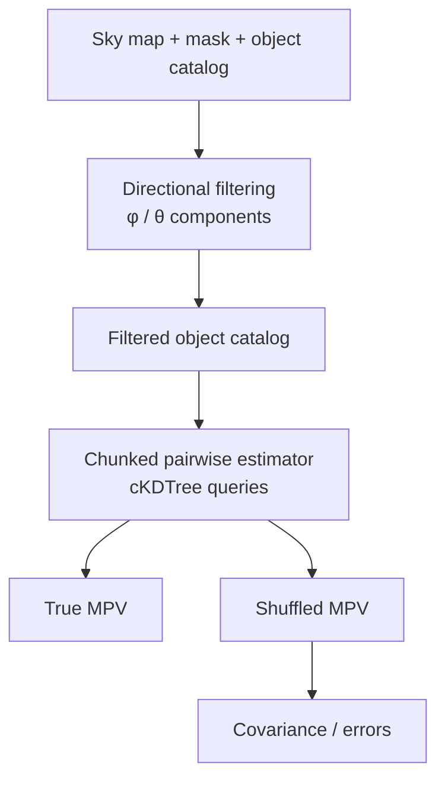

# Moving-Lens Analysis Pipeline

Python/HPC pipeline for extracting **moving-lens signals** from sky maps and estimating the **mean pairwise transverse velocity (MPV)** of large object catalogs.

The workflow combines directional matched filtering, large-catalog pairwise estimation, null tests, covariance estimation, and distributed computation.

**Tech:** Python, pandas, NumPy, SciPy, Astropy, cKDTree, Slurm/HPC

<p align="center">
  
</p>
<p align="center"><em>Schematic of the pairwise velocity contribution from a pair of objects.</em></p>

## Features

- **Directional matched filtering** for the two transverse moving-lens components
- **90°-rotated and gradient-null filters** for systematic/null tests
- **Moving-lens dipole templates** based on transverse velocity components
- **Chunked MPV estimation** for large catalogs using `scipy.spatial.cKDTree`
- **Exact aggregation** of estimator numerators and denominators across compute jobs
- **Deterministic shuffle tests** for null distributions and covariance estimation
- **Slurm workflows** for parallel filtering, MPV computation, and aggregation
- **Synthetic end-to-end demo** requiring no survey data

## Pipeline



## Repository structure

```text
extensions/
  moving_lens_filters.py    # matched, rotated-null, and gradient-null filters
  moving_lens_template.py   # transverse-velocity dipole template

pipelines/
  ts_pipeline.py            # filtering-stage orchestration
  mpv_pipeline.py           # chunked MPV estimator and covariance workflow

examples/
  generate_synthetic_inputs.py
  demo_moving_lens_extensions.py
  run_demo.sh

slurm/                      # HPC job templates
configs/                    # example configuration
tests/                      # extension tests
docs/                       # implementation notes
```

## Quick start

Create the environment:

```bash
conda env create -f environment.yml
conda activate movinglens_mpv
```

Run the synthetic end-to-end demo:

```bash
bash examples/run_demo.sh
```

The demo generates a mock catalog and transverse-filter outputs, computes the MPV, runs shuffled null realizations, and builds a covariance matrix.

The moving-lens filter and template extensions can also be exercised directly:

```bash
python examples/demo_moving_lens_extensions.py
```

Run the tests with:

```bash
python -m unittest discover -s tests
```

## MPV pipeline

A catalog can be supplied as an `.npz` file containing either

```text
ra_deg, dec_deg, redshift
```

or

```text
RA, DEC, Z
```

along with the transverse filter outputs.

Example chunk:

```bash
python pipelines/mpv_pipeline.py chunk \
  --ts-dir outputs/ts__map_example__cat_example \
  --catalog-npz /path/to/catalog.npz \
  --chunk-id 0 \
  --chunk-size 100000
```

Combine completed chunks:

```bash
python pipelines/mpv_pipeline.py combine \
  --outdir outputs/mpv__map_example__cat_example
```

Shuffle realizations use the same estimator with deterministic velocity permutations and can be combined to estimate the null covariance.

## ThumbStack integration

The filtering workflow extends the [ThumbStack](https://github.com/EmmanuelSchaan/ThumbStack) framework for moving-lens measurements. The moving-lens-specific filtering and template logic is available in `extensions/`, while `pipelines/ts_pipeline.py` provides the orchestration layer used with a compatible ThumbStack checkout.

## Data

Survey maps, catalogs, and collaboration data products are not distributed with this repository. The included synthetic example provides a self-contained way to exercise the main analysis workflow.
